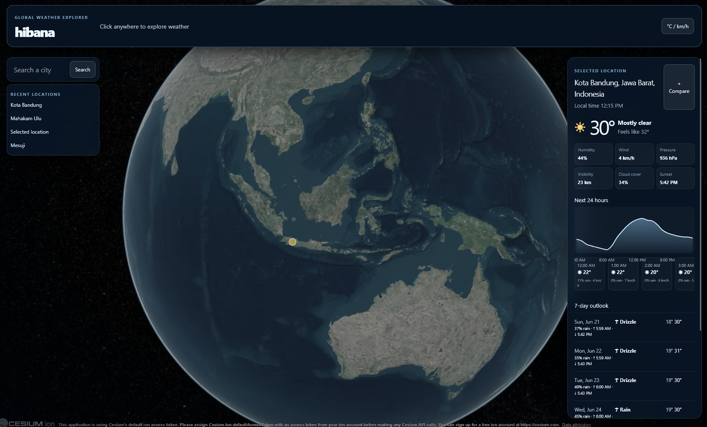
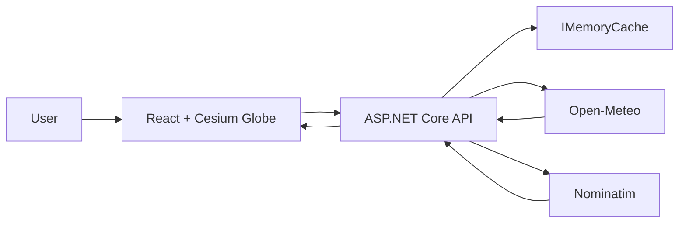

# Hibana

Hibana is an interactive global weather explorer built with React and ASP.NET Core. Pick anywhere on the 3D globe, search for a city, and inspect live conditions with hourly and seven-day forecasts. It has no accounts, database, Redis, queues, containers, or persistent backend state.

### Explore the globe



Click a point on Earth to fly the globe to that location and load its weather.

### Current conditions and forecasts

See the resolved location, local time, current conditions, hourly temperatures, and a seven-day outlook in a compact weather panel.

### City search and comparison

Search for a city, fly there, and compare up to four locations for the current browser session.

Future screenshot slots are documented in [public/images/screenshots/README.md](public/images/screenshots/README.md).

## What You Can Do

- Rotate, zoom, and select a land or ocean location on the 3D globe.
- View coordinates and a nearby location name when reverse geocoding succeeds.
- Inspect current temperature, feels-like temperature, humidity, wind, pressure, cloud cover, visibility, and sunset.
- Browse hourly temperature, precipitation probability, and wind forecasts.
- Browse a seven-day forecast with temperatures, precipitation, sunrise, and sunset.
- Search for cities and fly the globe to the chosen result.
- Switch between metric and imperial units.
- Compare up to four locations during the current browser session.
- Reopen recent locations stored only in the browser.

## Weather Request Flow

1. Click the globe or select a city from search.
2. The React client sends coordinates to `GET /api/v1/weather` on the ASP.NET Core API.
3. The API validates the request and checks `IMemoryCache`.
4. On a cache miss, the API requests weather from Open-Meteo and a location name from Nominatim concurrently.
5. The API returns one Hibana-owned response. If geocoding fails, weather still returns with a coordinate label.



## Tech Stack

| Layer          | Technology                                                              |
| -------------- | ----------------------------------------------------------------------- |
| Frontend       | React, TypeScript entry point, Vite, CesiumJS, TanStack Query, Recharts |
| Backend        | .NET 10, ASP.NET Core controllers, typed `HttpClient`, `IMemoryCache`   |
| API safeguards | Problem Details, rate limiting, health checks, OpenAPI                  |
| Weather        | [Open-Meteo](https://open-meteo.com/)                                   |
| Geocoding      | [OpenStreetMap Nominatim](https://nominatim.org/)                       |
| Tests          | xUnit and ASP.NET Core integration-test host                            |

## Local Setup

Requirements: .NET SDK 10, Node.js 20 or newer, and pnpm. No Docker, WSL, database, Redis, RabbitMQ, or Ollama is required.

Start the API in one CMD window:

```cmd
set PATH=C:\Users\USER\scoop\apps\dotnet-sdk-lts\current;%PATH%
dotnet run --project backend\src\Hibana.Api
```

Start the frontend in a second CMD window:

```cmd
pnpm run dev
```

Open `http://localhost:5173`. The API runs at `http://localhost:5000`.

Leave `VITE_API_BASE_URL` unset for local development. Set it only when the frontend and API are hosted on different origins.

## Main Routes

| Path                            | Purpose                                                       |
| ------------------------------- | ------------------------------------------------------------- |
| `GET /api/v1/weather`           | Normalized current, hourly, and daily weather for coordinates |
| `GET /api/v1/locations/search`  | City search results                                           |
| `GET /api/v1/locations/reverse` | Optional reverse-geocoding result                             |
| `GET /health/live`              | Liveness check                                                |
| `GET /health/ready`             | Readiness check                                               |
| `GET /openapi/v1.json`          | Development OpenAPI document                                  |

## Test

```cmd
set PATH=C:\Users\USER\scoop\apps\dotnet-sdk-lts\current;%PATH%
dotnet test backend\Hibana.sln
node_modules\.bin\tsc.CMD -p tsconfig.json
pnpm run build
```

## Stateless Architecture

Hibana uses only process-local `IMemoryCache` for temporary weather and geocoding results. Restarting the API safely clears the cache. There are no migrations, volumes, database configuration, user records, saved-location tables, or provider secrets in the browser.

## Deployment

Deploy the Vite build to a static host and the ASP.NET Core API to any .NET-compatible host. Set `Cors:AllowedOrigins` to the deployed frontend origin. The application needs no database deployment, Redis deployment, migrations, or persistent volume.
