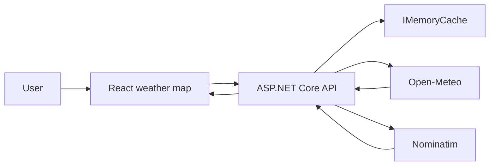

# Hibana - Interactive Global Weather Explorer

Hibana is a full-screen weather explorer. Pick any point on the interactive world map, search for a city, and inspect current conditions with hourly and daily forecasts. It has no accounts, database, Redis, containers, queues, or persistent backend state.

## What happens when you explore

1. You click the map or select a city.
2. The React client sends coordinates to `GET /api/v1/weather`.
3. The ASP.NET Core API validates the query and checks `IMemoryCache`.
4. On a miss, it calls Open-Meteo for weather and Nominatim for a location name concurrently.
5. Hibana returns its own normalized response. If reverse geocoding fails, the weather result still returns with a coordinate label.



## Technology

- Frontend: React, Vite, Leaflet, Recharts
- Backend: .NET 10, ASP.NET Core controllers, typed `HttpClient`, `IMemoryCache`, OpenAPI, Problem Details, rate limiting, health checks
- External providers: [Open-Meteo](https://open-meteo.com/) and [OpenStreetMap Nominatim](https://nominatim.org/)

The backend is intentionally stateless. Cached weather and location data lives only in process memory and disappears safely on restart.

## Local Windows setup

Required: .NET SDK 10 and Node.js 20 or newer. No Docker, WSL, database, Redis, RabbitMQ, or Ollama is required.

Run the API:

```cmd
dotnet restore backend/Hibana.sln
dotnet run --project backend/src/Hibana.Api
```

Run the client in a second CMD window:

```cmd
pnpm run dev
```

The client is served at `http://localhost:5173`; the API uses `http://localhost:5000` by default. Copy `.env.example` to `.env` only when the API runs on a different origin.

## API

- `GET /api/v1/weather?latitude=-6.9175&longitude=107.6191&hourlyHours=24&dailyDays=7&units=metric`
- `GET /api/v1/locations/search?query=Bandung`
- `GET /health/live`
- `GET /health/ready`

In development, OpenAPI is at `/openapi/v1.json`. Invalid query values return RFC 7807 Problem Details. The API limits public endpoint traffic to 60 requests per minute per application instance.

## Deployment

Deploy the Vite build to a static host and the API to any .NET-compatible host. Configure the allowed frontend origin under `Cors:AllowedOrigins`; do not expose provider credentials in the browser. There are no migrations, persistent volumes, or infrastructure services to deploy.

## Removed legacy product infrastructure

The previous IoT monitoring application, SQL Server, EF Core, Redis, RabbitMQ, SignalR, gRPC, Semantic Kernel, Ollama, MediatR, Prometheus, Sentry, Docker Compose, and CLI have been removed. Hibana now contains only the weather-explorer product.
